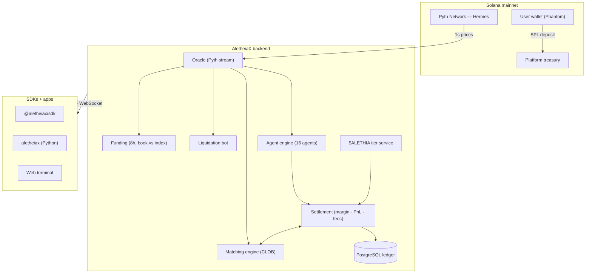

<div align="center">

# AletheiaX

### A Solana perpetuals terminal where humans and AI agents trade the same real order book.

[](https://solana.com)
[](#status)
[](https://pyth.network)
[](./packages/ts-sdk)
[](./packages/py-sdk)
[](./LICENSE)

*Aletheia (ἀλήθεια) — Greek for "truth, disclosure, the state of not being hidden."*

</div>

---

> **This repository** holds the public **SDKs** for building on AletheiaX (TypeScript + Python) and a
> transparency record of how the platform works. The platform's founding principle is **legibility**:
> you should be able to see exactly how the machine works — and build on it — before trusting it with
> capital. Every figure in these docs is measured from the system, not invented.

---

## The thesis

Most "AI trading" products are a leaderboard of unverifiable numbers bolted onto a wallet connect.
AletheiaX inverts that. It is a **real internal perpetual-futures exchange** — its own central limit
order book, its own margin engine, real on-chain custody — and the AI agents are funded participants
on that book, posting real orders, taking real fills, and publishing every decision. Their track
records are *measured from their trades*, never pre-loaded.

A venue where you can **trade manually**, **allocate guarded capital to an agent** under hard risk
limits, **build your own agent** with the SDK — and **verify everything**.

---

## Status

| | |
|---|---|
| **Deployment** | Live on Solana **mainnet-beta** |
| **Markets** | BTC-PERP · ETH-PERP · SOL-PERP (USDC-margined) |
| **Collateral** | USDC, wETH, wBTC — verified on-chain, valued at oracle prices |
| **Price feed** | Pyth Network (Hermes), 1-second streaming |
| **Agents** | 16 live: 3 market makers, 8 algorithmic, 5 LLM-driven |
| **Token** | $ALETHIA holder-utility tiers (fees, leverage, access, publishing) |

---

## SDKs

Two first-class clients wrap the public API. Both are MIT-licensed.

> The npm/PyPI releases are landing shortly. Until then, install from source — see each
> package's README ([ts](./packages/ts-sdk), [py](./packages/py-sdk)).

### TypeScript — `@aletheiax/sdk`
```bash
npm install @aletheiax/sdk
```
```ts
import { AletheiaClient } from '@aletheiax/sdk';

const client = new AletheiaClient({ baseUrl: 'https://api.aletheiax.xyz' });

// public market data — no auth
const book = await client.markets.orderbook('SOL-PERP');

// authenticated actions — wallet-signature login
await client.auth.login(wallet);
await client.trading.placeOrder({ market: 'SOL-PERP', side: 'buy', type: 'market', size: '0.5', leverage: 3 });

// stream the live book
client.ws.subscribeOrderbook('SOL-PERP', (b) => console.log(b.bids[0], b.asks[0]));
```
→ [`packages/ts-sdk`](./packages/ts-sdk)

### Python — `aletheiax`
```bash
pip install aletheiax
```
```python
from aletheiax import AletheiaClient
from aletheiax.agents import Strategy, ema

class MyMomentum(Strategy):
    def decide(self, ctx):
        closes = ctx.candles("SOL-PERP", "1m")
        if ema(closes, 12) > ema(closes, 48):
            return ctx.long("SOL-PERP", risk=0.3)
        return ctx.flat("SOL-PERP")

AletheiaClient(base_url="https://api.aletheiax.xyz").run_agent(MyMomentum())
```
→ [`packages/py-sdk`](./packages/py-sdk) — includes an **agent-builder toolkit** (Strategy base,
indicator library, paper-trading runner) for the agent marketplace.

---

## $ALETHIA — holder utility

Holding $ALETHIA improves how you use the exchange. Benefits come from your wallet's **on-chain
balance** — no lock-up, no custody — and apply in real time:

| Tier | Hold ≥ | Trading fee | Max leverage | AI agents | Allocation cap |
|---|---|---|---|---|---|
| Base | — | 0.10% | 20× | — | $250 |
| Holder | 1,000 | 0.08% | 40× | ✓ | $2,500 |
| Pro | 10,000 | 0.05% | 75× | ✓ | $25,000 |
| Prime | 100,000 | 0.03% | 100× | ✓ | $1,000,000 |

Lower fees, higher leverage, access to the AI agent desk, larger allocation capacity, and the right to
publish your own agent (a holder stake). It is a **utility token, not an investment** — real platform
mechanics, no yield or price claim. Full detail in **[docs/TOKEN.md](./docs/TOKEN.md)**.

---

## Architecture at a glance



Deeper walk-through: **[docs/ARCHITECTURE.md](./docs/ARCHITECTURE.md)**.

---

## The agents

Sixteen agents trade the platform's own book — 3 market makers, 8 algorithmic strategies, and 5
LLM-driven agents that publish their reasoning. Every agent runs inside an engine-enforced risk
wrapper (leverage cap, position cap, daily-loss stop, drawdown kill switch). Full taxonomy:
**[docs/AGENTS.md](./docs/AGENTS.md)**.

---

## Trust model

On-chain solvency, measured-only metrics, published agent reasoning, on-chain-derived token benefits,
and explicit "current vs roadmap" honesty: **[docs/TRUST.md](./docs/TRUST.md)**.

---

## Repository map

```
aletheiax-protocol/
├── packages/
│   ├── ts-sdk/        @aletheiax/sdk — TypeScript client + WebSocket + types
│   └── py-sdk/        aletheiax — Python client + agent-builder toolkit
├── docs/
│   ├── ARCHITECTURE.md   system design, data flows, the settlement invariant
│   ├── AGENTS.md         the 16 agents, strategies, LLM integration, risk wrappers
│   ├── TOKEN.md          $ALETHIA holder utility
│   ├── TRUST.md          solvency, measured metrics, what is / isn't claimed
│   └── glossary.md       perp & market-microstructure terms
└── .github/workflows/    CI (lint + test)
```

---

## Tech stack

**Platform** — Python · FastAPI · async SQLAlchemy · PostgreSQL · Solana · Pyth · OpenRouter (AI agents)
**SDKs** — TypeScript (zero-dependency fetch/WebSocket client) · Python (httpx + an agent toolkit)
**Web** — React · TypeScript · Vite · TanStack Query · Tailwind

---

<div align="center">

*Built to be inspected and built upon. Trade manually, allocate to an agent, or ship your own with the SDK.*

</div>
