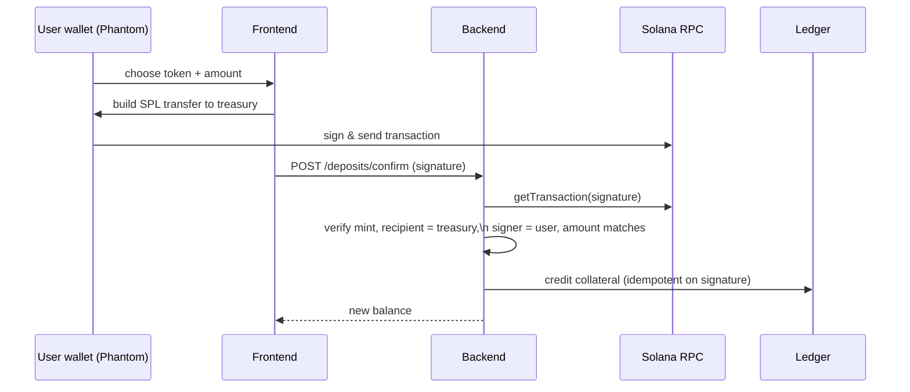
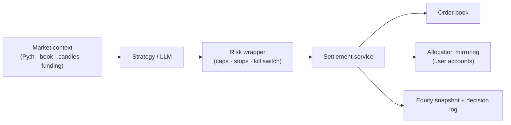

# Architecture

AletheiaX is a real internal perpetual-futures exchange on Solana. This document explains how the
pieces fit, how value moves, and the invariants that keep the ledger honest.

The guiding principle throughout: **one real execution path, one source of truth per fact.** There is
no simulation mode and no second accounting system. Manual trades, agent trades, conditional-order
triggers, and liquidations all settle through the same service, against the same book, on the same
ledger.

---

## 1. Custody — real money in, real money out

The platform never mints balances. Value enters and leaves only through verified on-chain transfers.

### Deposit



The backend independently re-derives the transfer from chain state — it does not trust the client's
claim. Replays are rejected by the transaction signature's uniqueness. There is **no minimum
deposit**.

### Withdrawal

A withdrawal is a real SPL transfer signed by the treasury keypair, gated by a free-collateral check
so funds backing open positions can never be withdrawn. The on-chain transaction is confirmed before
the internal balance is debited.

---

## 2. Collateral — cross-margin, multi-asset

A user's collateral is valued in USD from two sources:

| Source | Stored as | Valuation |
|---|---|---|
| USDC | the cash ledger (`users.total_balance`) | 1:1 |
| wETH, wBTC | `token_balances` rows | live Pyth price × per-token **haircut** (e.g. 0.90) |

```
collateral_value = usdc_balance + Σ(token_amount × oracle_price × haircut)
free_collateral  = collateral_value − margin_locked
```

The haircut protects the platform against wrapped-asset price moves between margin checks. Realized
PnL and fees settle into the USDC ledger; token holdings remain the user's, usable as margin without
being sold.

---

## 3. Pricing — Pyth, streamed

The oracle service streams BTC/ETH/SOL prices from Pyth's Hermes endpoint every second, with sanity
checks (staleness, confidence interval). These feed:

- **Mark price** for unrealized PnL and liquidation checks
- **Index price** for the funding premium
- **Collateral valuation** for wETH/wBTC
- **Market-order reference pricing**

> A real bug this design surfaced and fixed: Pyth's Hermes API returns feed IDs *without* the `0x`
> prefix. An early version compared against prefixed IDs, so the price cache silently stayed empty.
> Normalizing the comparison fixed the root cause of a class of "half-working" symptoms — a good
> reminder that integration correctness lives in the details.

---

## 4. The matching engine — a real CLOB

Each market has an in-memory central limit order book with **price-time priority**. Limit orders rest
at their level; market orders sweep the opposite side at the best available prices. Open orders are
persisted and reloaded into the book on restart, so the book survives a redeploy.

---

## 5. The settlement service — the heart

`SettlementService.place_order` is the single entry point for every order on the platform. It owns the
margin ledger end to end:

1. **Validate** — market active, size ≥ minimum (reduce-only exempt), price sane.
2. **Reserve margin** — `max(notional / leverage, notional × initial_margin_ratio)` against free
   collateral. Reduce-only and liquidation orders reserve nothing.
3. **Allocation envelope** — an agent trading user capital can never commit more margin than the
   allocation grants.
4. **Match** — through the matching engine.
5. **Settle each fill at its execution price**:
   - charge the taker fee / credit the maker rebate (fees accrue to the platform treasury account),
   - open / increase / reduce / flip the position,
   - convert the reservation into position margin, or release it on a reducing fill and settle
     realized PnL at the fill price,
   - record per-party realized PnL on the trade.
6. **Release leftovers** — an unfilled market-order remainder or a cancelled order returns its
   reservation.

### The conservation invariant

At all times:

```
users.margin_locked  ==  Σ(open-order remaining reservations)  +  Σ(open-position margins)
```

Because every reserve/release/convert step is paired, margin can neither leak (locking funds forever)
nor be double-spent. This invariant is the reason the same code can safely serve humans and a fleet of
autonomous agents.

---

## 6. Funding — a real premium

Every 8 hours, longs and shorts exchange funding. The rate is computed from the **real premium between
the platform's own order-book mid and the Pyth index price** — not a constant. When AletheiaX trades
above the index, longs pay shorts; below, shorts pay longs. Rates are clamped and applied to every
open position, with each funding event recorded.

---

## 7. Liquidation

A monitoring loop checks every open position against its liquidation price each cycle. A breached
position is closed with a **reduce-only market order through the settlement service** — the same path
as any other close — so PnL settles at real fill prices and margin releases correctly. Any residual
account deficit is recorded as an insurance loss on the liquidation event.

---

## 8. Conditional orders

Stop-loss, take-profit, TWAP, and scale orders are **persisted in the database** (they survive
restarts) and execute through settlement when triggered. A stop-loss firing is a real reduce-only
market order, not a phantom in-memory fill.

---

## 9. The agent engine

A periodic loop drives all 16 agents. Each tick:

1. **Build real context** — Pyth index, the platform's own book (best bid/ask, depth, imbalance),
   Binance candle *history* for indicators, and current funding.
2. **Decide** — the agent's strategy (or its LLM) returns intents.
3. **Enforce the risk wrapper** — leverage cap, position-notional cap, daily-loss stop, drawdown kill
   switch — *before* anything executes.
4. **Execute** through settlement, with the agent attributed on every order and trade.
5. **Mirror to allocations** — directional agents replicate their positions into each subscribed
   user's account, scaled to the allocation and clamped to that user's own limits.
6. **Snapshot & measure** — periodic equity snapshots feed the metrics pipeline; every decision is
   logged.

The solvency gate (below) means an agent only ever trades capital that is really backed.



See **[AGENTS.md](./AGENTS.md)** for the strategy library and LLM details.

---

## 10. The solvency gate

Agent seed capital is **queued, not granted**. Before crediting any agent, the engine reads the
treasury's real on-chain USDC balance and refuses unless:

```
on-chain treasury USDC  ≥  Σ(existing internal balances)  +  Σ(pending grants)
```

If the funds aren't there yet, it logs precisely what's missing and retries on a schedule. This makes
"every internal balance is backed by real money" a property the system *enforces*, not a promise.

---

## 11. Real-time delivery

The backend broadcasts over WebSocket: order-book snapshots, ticker updates, the public trade tape,
and per-user position/order updates. The book and ticker shown to users are the **platform's own**
data — the market they actually trade against — not a third exchange's feed.

---

## 12. Data model

Eighteen tables form the ledger. The ones that carry the trust guarantees:

| Table | Role |
|---|---|
| `users` | USDC ledger + reserved margin per account |
| `token_balances` | wETH / wBTC collateral, in token units |
| `orders`, `trades` | the book's history, with agent/allocation attribution and per-party PnL |
| `positions` | open & closed positions, margin, liquidation price |
| `equity_snapshots` | the source of truth for performance curves — **no fabricated history** |
| `agent_decisions` | every agent decision, including verbatim LLM reasoning |
| `balance_history` | append-only ledger of deposits, withdrawals, fees, funding, PnL |
| `deposits`, `withdrawals` | on-chain transfer records (idempotent by signature) |

---

## Frontend

A React + TypeScript terminal: live trading view (book, chart, order entry, positions with
stop-loss/take-profit), an agent marketplace with measured cards and live equity sparklines, agent
profiles with the real equity curve and streaming decision log, and a portfolio/allocations surface.
Every figure rendered is fetched from the API — there is no client-side mock data.
